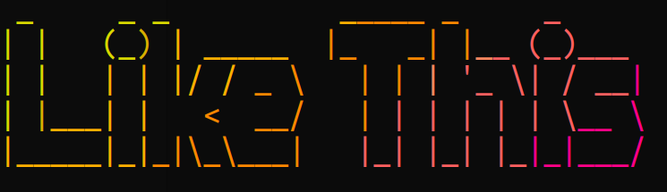
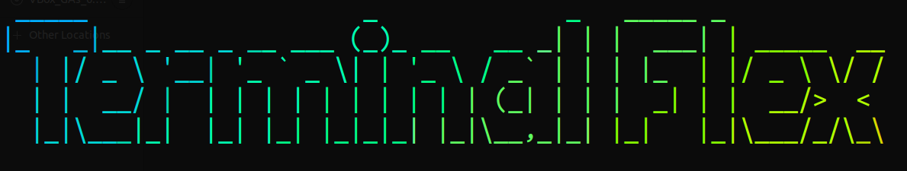

# TerminalFlex
A cool banner forming tool
# Description
Make your Terminal greet you with banners 
<p>  </p>
<p>  </p>
<p>  </p>

# Installing 
### Make sure to clone this repo in `/opt` directory 

```
cd /opt
sudo git clone https://github.com/Dark-Knight11/TerminalFlex.git 
cd TerminalFlex
./setup.sh
```
# Usage 
Run the `TerminalFlex.sh` file. 

It will ask for the text for banner, enter that and you're done. 

`./TerminalFlex.sh`
